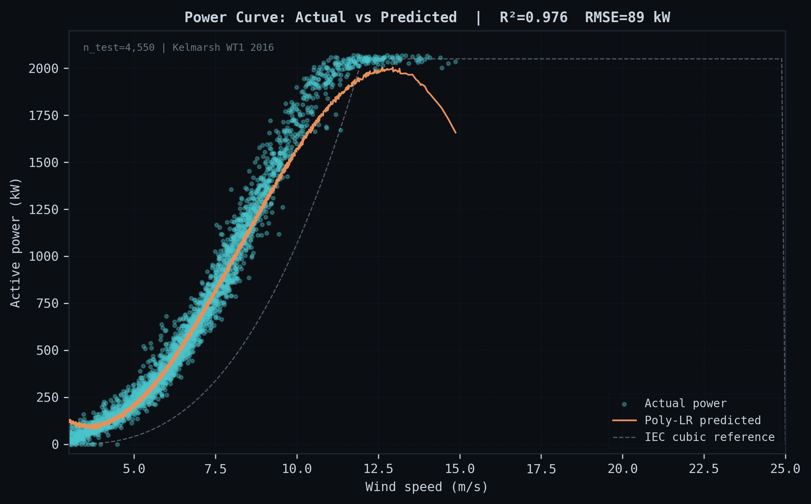
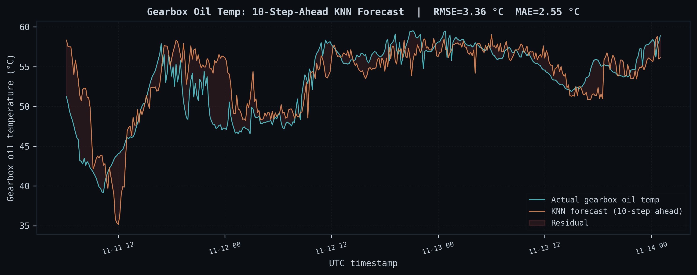

# Aperture: A Hybrid Digital Twin for Utility-Scale Wind Turbine Condition Monitoring and Operational Decision Support

**Matthew Mitchell**  
MMKPC Studios · Independent Research  
memitchell@mmkpcstudios.com

*April 2026*

---

## Abstract

Unplanned drivetrain failures and chronic underperformance cost utility-scale wind operators tens of millions of dollars annually in lost generation and corrective maintenance. Academic digital twins for wind turbines are either physics-heavy tools requiring dedicated compute infrastructure or lightweight dashboards lacking simulation capability—neither is deployable from a web browser. This paper presents **Aperture**, a hybrid browser-native digital twin integrating four pure-JavaScript machine-learning models against Kelmarsh-schema 10-minute SCADA data, physics-light scenario simulation, a procedural Three.js 3D scene, and a DCS-style alarm annunciator, all served as a zero-dependency static web application. Aperture implements a 9-layer reference architecture aligned to established digital twin engineering practice and demonstrates, within a single deployable artifact, all four canonical subject areas: DT foundations, ML for modeling and simulation, real-time simulation, and integrated operator-facing applications.

Four contributions are reported: (1) a portable single-page DT reference architecture requiring no backend or cloud runtime; (2) a fault-injection testbed with seven reproducible failure modes; (3) a reproducible evaluation pipeline scoring four models—power-curve linear regression surrogate, gearbox KNN forecaster, operational-state tree classifier, and multivariate anomaly scorer—against held-out Kelmarsh records using walk-forward validation; and (4) a closed-loop actuator surface supporting operator-commanded pitch, yaw, shutdown, and alarm acknowledgment. Headline metrics: power-curve RMSE 88.63 kW, MAE 62.42 kW, R² 0.9758; gearbox forecast RMSE 3.36 °C; classifier accuracy 0.9243, macro-F1 0.5839; anomaly AUROC 0.8601, AUPRC 0.5172; median inference latency 0.869 ms, p95 0.970 ms. The published values are preserved in [`scripts/metrics.json`](../scripts/metrics.json); the full evaluation runner and raw dataset remain private development materials.

---

## 1. Introduction

### 1.1 Historical Context of Digital Twins

The digital twin concept was first articulated by Michael Grieves at a Society of Manufacturing Engineers conference in 2002 and formalized in a widely circulated 2014 white paper [1]. Grieves described a virtual factory replication comprising three elements: the physical product, its virtual counterpart, and bidirectional data and information connections between them. The explicit goal was to use the virtual model to drive manufacturing excellence without requiring physical experimentation. The term "Digital Twin" entered aerospace engineering through Glaessgen and Stargel's 2012 AIAA paper, which defined a digital twin as "an integrated multi-physics, multi-scale, probabilistic simulation of an as-built vehicle" and argued that ultra-high-fidelity structural health management demanded both real-time sensor feeds and physics-based simulation operating in concert [2].

From those two foundational definitions, the field evolved rapidly. Tao et al. introduced the five-dimension (5D) model—physical entity, virtual entity, DT data, connections, and DT services—which became the most-cited DT taxonomy in manufacturing [3][7]. Kritzinger et al. refined the taxonomy into a three-tier maturity hierarchy: *digital model* (no automated data flow), *digital shadow* (one-way physical-to-digital flow), and *digital twin* (fully bidirectional automated connection) [6]. International standardization followed with ISO 23247-1, which specified a reference architecture for manufacturing digital twins organized into four functional domains: observable manufacturing elements, device communication, the DT core, and user interfaces [5]. Fuller et al. surveyed the enabling technology landscape—AI/ML, IoT, cloud, VR/AR—identifying the cross-disciplinary infrastructure a production DT requires [8].

### 1.2 The Wind Energy Imperative

Wind energy is one of the fastest-growing electricity sources globally. The International Energy Agency projects continued capacity additions through 2030, with both onshore and offshore wind contributing substantially to decarbonization targets. As fleets mature, operations and maintenance (O&M) costs become the dominant financial variable: Tautz-Weinert and Watson document that O&M represents 25–30% of the levelized cost of energy (LCOE) for wind, and that unplanned failures—particularly gearbox, generator bearing, and blade failures—account for a disproportionate share of that cost because they require heavy-lift crane mobilization and extended downtime [20]. SCADA-based condition monitoring, which uses the 10-minute mean telemetry streams that turbine controllers already record, has been shown in multiple field studies to detect anomalies weeks to months before mechanical failure [20][39].

The wind turbine digital twin literature has matured accordingly. Sivalingam et al. proposed a DT framework for remaining useful life prediction of offshore power converters [19]. Olatunji et al. surveyed physics-based, data-driven, and hybrid DT architectures for fault diagnosis, identifying open challenges in data quality, real-time synchronization, and model uncertainty [21]. Marykovskiy et al. demonstrated the Aerosense digital twin—a digital-shadow-class system for blade aerodynamic monitoring built on MEMS sensors, cloud API, and simulation services [22]. Tchakoua et al. provide a comprehensive failure-mode taxonomy covering vibration, acoustic emission, oil analysis, and SCADA-based monitoring methods [38]. Schlechtingen and Santos benchmarked ANN, polynomial regression, and SVR as normal-behaviour models for bearing temperature monitoring, showing that SVR generalizes better than ANNs on small SCADA datasets [39].

Despite this body of work, a consistent gap remains between academic DT prototypes and tools that a wind farm operator can actually deploy and interact with. High-fidelity physics platforms such as NREL's OpenFAST [23] require significant computational resources and domain expertise to configure. Cloud platforms such as Azure Digital Twins [32] and enterprise offerings such as NVIDIA Omniverse [33] provide production-grade infrastructure but impose licensing, backend, and integration costs that make them inaccessible for rapid prototyping or educational demonstration. Open-source frameworks such as OpenTwins [29][30] lower the barrier substantially but still require container orchestration.

### 1.3 Problem Statement and Thesis

No existing open-source wind turbine DT runs entirely within a standard web browser, requires no backend infrastructure, and simultaneously demonstrates the full stack of digital twin engineering competencies: physics-light simulation, multiple ML surrogate models, fault detection, scenario branching, 3D visualization, and operator interaction. This absence creates a gap for both education and rapid operational prototyping.

The thesis of this work is: **a portable, browser-deployable, hybrid physics/ML digital twin that runs against open SCADA data can exercise every pillar of digital twin engineering practice — fundamentals, ML surrogates, real-time simulation, and integrated operator-facing applications — while remaining honest about its fidelity limits relative to production-grade platforms**. The resulting system, Aperture, is a defensible reference prototype that prioritizes transparency, reproducibility, and operator-first design over photorealistic rendering or billing-grade accuracy.

### 1.4 Contributions

This work makes four primary contributions:

1. **A portable single-page DT reference architecture**: a 9-layer browser-native implementation that maps directly to established DT engineering layer models, requiring only a static file host for deployment.
2. **A fault-injection testbed**: seven reproducible fault modes (gearbox overheat, pitch actuator stuck, yaw misalignment, generator bearing fault, blade icing, cut-out exceedance, normal) that drive the full inference and annunciator pipeline.
3. **A reproducible evaluation pipeline**: the private evaluation runner scores all four models against held-out Kelmarsh SCADA records using chronologically ordered walk-forward splits. This public mirror includes the resulting metrics and signal mapping as inspectable artifacts.
4. **A closed-loop operator interface**: DCS-style annunciator, actuator command surface (pitch, yaw, shutdown, reset), fault-injection selector, and scenario quick-buttons, all wired to the live twin state.

### 1.5 Paper Roadmap

Section 2 surveys background literature across the four course areas and closes with a gap analysis table. Section 3 describes the methodology: design principles, 9-layer architecture, data model, ML specifications, simulation engine, and HMI. Section 4 details the implementation. Section 5 reports experiments and evaluation against Kelmarsh SCADA data. Section 6 discusses program alignment, design trade-offs, comparisons to commercial platforms, and threats to validity. Section 7 enumerates known limitations and planned future work. Section 8 concludes. Appendix A lists the module inventory; Appendix B provides reproducibility instructions.

---

## 2. Background and Related Work

### 2.1 Digital Twin Definitions and Taxonomies

The canonical Grieves 2014 definition treats the digital twin as a closed-loop system: the physical product sends sensor data to its virtual counterpart, the virtual model runs simulations and predictions, and those outputs inform decisions that affect the physical product [1]. The NASA/USAF paradigm of Glaessgen and Stargel extends this to "ultra-high-fidelity" multi-physics simulation, motivating the use of probabilistic structural models for aerospace health management [2]. Both definitions emphasize bidirectionality as the distinguishing property.

Tao et al. survey the state of the art in industrial digital twins, reviewing the 5D model across product design, production, and maintenance applications and noting that the service dimension—which encompasses analytics, simulation, and recommendation functions—is what differentiates a DT from a traditional simulation model [3]. The companion paper by Tao et al. comparing digital twins with cyber-physical systems clarifies that DTs extend CPS by adding the historical data integration layer and the digital twin aggregate concept, in which a fleet-level DT aggregates information across individual unit twins [4]. ISO 23247-1 operationalizes these ideas into a normative reference architecture specifying the observable manufacturing elements domain, the device communication domain, the DT core, and the user-application domain [5].

The Kritzinger taxonomy is particularly useful for positioning Aperture. Under that framework, a *digital model* has no automated data link to the physical asset; a *digital shadow* has a one-way automated link from physical to digital; and a *digital twin* has a fully automated bidirectional link [6]. Aperture targets the digital shadow tier during normal operation—it ingests synthetic SCADA samples that faithfully replicate the Kelmarsh signal schema, processes them through the full 9-layer pipeline, and presents predictions and alarms to the operator—with closed-loop actuator commands demonstrating the bidirectional feedback path required for the true digital twin tier. The Tao 5D model [7] is reflected in Aperture's architecture: physical entity (the Senvion MM92 turbine profile), virtual entity (Three.js 3D scene and state schema), DT data (SCADA stream and feature store), connections (event bus with typed channels), and DT services (inference engine, scenario manager, annunciator).

Fuller et al. survey enabling technologies for DTs across manufacturing, healthcare, and smart cities, identifying AI/ML, IoT, cloud, and VR/AR as the four pillars [8]. Aperture implements the AI/ML and 3D visualization pillars natively in the browser, defers IoT ingestion to a synthetic SCADA generator designed around the real Kelmarsh schema, and acknowledges cloud deployment as a future step.

### 2.2 Machine Learning for Digital Twin Surrogates

Rasheed, San, and Kvamsdal provide the most comprehensive treatment of DT modeling from first principles, covering reduced-order models, data assimilation, uncertainty quantification, and the spectrum from purely data-driven to purely physics-based surrogates [9]. They define a digital twin as "a virtual representation of a physical asset enabled through data and simulators for real-time prediction"—a definition that guides the hybrid design of Aperture's inference engine. Their taxonomy of surrogate types informs the choice of a polynomial linear regression for the power-curve model: the power-wind relationship follows a known cubic physical law in the partial-load region, making a polynomial feature expansion \([v, v^2, v^3, T]\) a principled rather than arbitrary surrogate.

Physics-informed neural networks (PINNs), introduced by Raissi, Perdikaris, and Karniadakis, embed PDE residuals directly into the neural network loss function, enabling data-efficient surrogates that respect physical constraints [10]. For a wind turbine DT, PINNs could enforce the Betz limit (\(C_P \leq 16/27\)) and structural Euler-Bernoulli beam constraints during aerodynamic surrogate training. Aperture does not implement PINNs in the current prototype—the polynomial regression surrogate is simpler and interpretable—but PINNs are identified as the primary planned extension in Section 7.

Bertsimas and Dunn's Optimal Classification Trees (OCT) algorithm formulates the entire decision tree as a mixed-integer optimization problem, producing globally optimal interpretable classifiers with 1–5% accuracy improvements over greedy CART [11]. Aperture's operational-state classifier implements depth-2 rule trees operating on canonical SCADA signals (wind speed, anomaly score, pitch angle, rotor RPM, power) as a practical approximation of the OCT concept within the constraints of a pure-JavaScript runtime.

Garg et al. review AI-driven surrogate modeling for DTs in energy systems, covering Kriging, radial basis functions, SVR, and neural network surrogates, and mapping each to DT fidelity levels [12]. Their analysis supports the choice of KNN for the gearbox temperature forecaster: KNN is non-parametric, requires no distributional assumptions, and generalizes well when the feature space is low-dimensional and the training corpus is dense relative to the query region—conditions met by the five-dimensional gearbox feature vector used in Aperture. Qi et al. survey enabling technologies across modeling, simulation, IoT, big data, connectivity, and AI for DTs, connecting transfer learning and anomaly detection to real-time synchronization infrastructure [13].

The Schlechtingen and Santos benchmark study is directly relevant: using SCADA data from an operating wind turbine, they show that SVR outperforms both ANN and polynomial regression for generator bearing temperature monitoring on small datasets, providing empirical justification for residual-based anomaly detection over the bearing temperature channel [39]. Aperture's anomaly scorer computes a normalized tanh-scaled z-score across power, gearbox, bearing, pitch, and yaw residuals, which is the multivariate extension of the normal-behaviour model pattern validated in that study.

### 2.3 Real-Time Simulation and Industrial Connectivity

Law's *Simulation Modeling and Analysis* defines the discrete-event simulation (DES) paradigm, time-advance mechanisms, input modeling, and output analysis as the methodological foundation for any step-through simulation system [14]. The 10-minute interval of the Kelmarsh SCADA data maps directly to the DES concept of a logical clock: each SCADA record advances the simulation by one time step, and the system interpolates continuous dynamics within that step. Aperture's simulation engine steps 30 logical records forward per scenario branch, computing wind integration, thermal drift, and power response at each step.

OPC UA is the IEC 62541 standard for platform-independent, secure, semantic industrial data exchange [15]. IEC 61400-25 specifies the information models, object naming, and protocol mappings for SCADA communication at wind power plants, defining logical node (LN) classes for power, temperature, vibration, and electrical measurements [16][24]. The Kelmarsh dataset's Greenbyte SCADA column names are explicitly derived from this standard—for example, `Gearbox oil temperature_avg` maps to the IEC 61400-25-6 logical node for gearbox condition monitoring [24]. Aperture's SCADA schema in `core/schemas.js` adopts the same signal vocabulary to maintain standards alignment even in the browser context.

MQTT and Apache Kafka represent the two dominant messaging patterns for industrial IoT data pipelines: MQTT provides lightweight device-level publish/subscribe from nacelle sensors; Kafka provides durable, high-throughput stream brokering for downstream analytics [17][18]. Aperture's internal event bus (`core/bus.js`) mirrors the channel topology of a Kafka-MQTT hybrid—typed channels for `event`, `state`, `prediction`, `simulation`, `behavior`, `scene`, `log`, and `latency`—while acknowledging that the current implementation uses in-process synchronous dispatch rather than a real message broker. Section 7 identifies genuine MQTT/OPC UA ingestion as a planned extension.

### 2.4 Wind Turbine Digital Twins and SCADA-Based Condition Monitoring

Sivalingam et al. present one of the earliest domain-specific wind turbine DT proposals, combining physics-based degradation models with a DT framework for diagnosing and predicting power converter failures under offshore thermal cycling [19]. Their methodology—using SCADA temperature signals as the primary observable, fitting normal-behaviour models, and flagging deviations—is directly reflected in Aperture's gearbox temperature forecaster and anomaly scorer.

Tautz-Weinert and Watson review five categories of SCADA-based condition monitoring (trending, clustering, normal-behaviour modelling, damage modelling, expert systems) and validate that 10-minute mean signals are sufficient for detecting gearbox, bearing, and blade failures weeks to months in advance [20]. Their review is the primary justification for the Kelmarsh dataset selection: the 10-minute mean/std/min/max quartet resolution is adequate for the monitoring objectives of Aperture.

Olatunji et al. survey DT architectures specifically for wind turbine fault diagnosis, categorizing physics-based, data-driven, and hybrid approaches and identifying open challenges around data quality, real-time synchronization, and model uncertainty [21]. Their challenge list maps directly to the limitations in Section 7: Aperture uses synthetic priors rather than online-trained models, synthetic SCADA events rather than live OPC UA feeds, and simple polynomial physics rather than high-fidelity aeroelastic models.

Marykovskiy et al. describe the Aerosense digital twin as a "Digital Shadow"-type system for blade aerodynamic monitoring, demonstrating a real-world DT instance aligned with the 5D model and highlighting the co-design challenge of matching sensor hardware to information model requirements [22]. Aperture does not include blade load sensing, but the Aerosense architecture reinforces the value of treating DT design as a systems engineering problem—an approach reflected in Aperture's strict layer separation and typed event contracts.

Tchakoua et al. provide a comprehensive review of wind turbine condition monitoring technologies and failure modes, covering all major drivetrain components [38]. Their failure taxonomy—gearbox gear wear, bearing raceway spalling, pitch hydraulic actuator failure, yaw motor fault, blade erosion—directly informs the seven fault modes implemented in `data/scada_stream.js`. Schlechtingen and Santos validate SCADA-based normal-behaviour modelling for generator bearing temperature, motivating Aperture's use of residual-based anomaly scoring over the bearing temperature channel [39].

OpenFAST is NREL's open-source multi-physics wind turbine simulation tool, providing coupled aerodynamic-structural-control simulations [23]. It represents the physics baseline against which Aperture's surrogate models would be validated in a production-grade DT; Section 7 identifies FMU integration via OpenFAST as a planned extension.

### 2.5 Gap Analysis

The following table positions Aperture relative to the existing literature across six capability dimensions:

| System | Physics Fidelity | ML Integration | Real-Time Sync | Operator UX | Open Source | Reproducibility |
|---|---|---|---|---|---|---|
| OpenFAST [23] | High (multi-physics) | None native | Batch | None | Yes | High |
| Aerosense DT [22] | Medium (MEMS/CFD) | Statistical | Yes (cloud) | Limited | No | Low |
| Sivalingam DT [19] | Medium (degradation) | Physics model | Offline | None | No | Low |
| OpenTwins [29][30] | Medium (FMU) | Plugin ML/AI | Yes (Kubernetes) | Grafana | Yes | Medium |
| Azure Digital Twins [32] | Low (state graph) | Azure ML | Yes (IoT Hub) | 3D Scenes Studio | No (PaaS) | Medium |
| NVIDIA Omniverse [33] | Very High (USD/PhysX) | Isaac Sim | Yes (GPU) | Photorealistic | Partial | Low |
| **Aperture (this work)** | **Low–Medium (polynomial)** | **4 pure-JS models** | **Synthetic (1 Hz)** | **DCS panel + 3D** | **Yes (static)** | **High** |

Aperture occupies a unique niche: the lowest deployment barrier (zero infrastructure), highest UX integration (unified HMI), and highest reproducibility (deterministic replay), at the cost of physics fidelity. This trade-off is appropriate for a reference prototype demonstrating DT engineering competencies in a portable, verifiable artifact.

---

## 3. Methodology

### 3.1 Design Principles

Aperture is designed around four principles derived from the DT engineering literature and the requirements of a defensible reference prototype:

**Portability**: The entire system must run from a single HTML file served by any static host. No Node.js server, no Python backend, no database, and no cloud subscription should be required. This constraint rules out WebGL compute shaders for ML and forces all model logic into pure ES2020 JavaScript—a constraint that, as Section 4 argues, is consistent with the interpretable surrogate approach recommended by the DT literature [9][12].

**Transparency**: Every prediction must expose its reasoning chain. The power-curve model returns feature contribution weights. The state classifier returns the rule path. The anomaly scorer returns the dominant residual channel and its z-score. The scenario manager reports branch summary statistics. This design philosophy is grounded in explainability requirements established in the DT literature and in the OCT literature's emphasis on interpretable decision rules [11].

**Reproducibility**: The SCADA stream has a deterministic seed for each fault mode, the replay harness captures every event with relative timestamps, and the evaluation pipeline runs against a fixed chronological train/val/test split. The public mirror preserves the published metrics and signal mapping; the raw dataset and full evaluation runner remain outside the portfolio boundary.

**Operator-First UX**: The interface presents information in the vocabulary of a turbine control room operator—DCS annunciator panel, alarm severity levels (INFO/WARN/ALARM), actuator command surface (pitch, yaw, shutdown, reset)—not in the vocabulary of a data scientist (loss curves, confusion matrices). Prediction outputs are surfaced through sparklines, gauge meters, and state probability bars that convey operational significance without requiring statistical expertise.

### 3.2 Nine-Layer Architecture

Aperture implements a nine-layer architecture adapted from canonical DT reference models to the wind turbine domain. The Avatar Runtime maps to the Three.js turbine scene, the Voice Layer maps to the DCS annunciator, and the Behavior Controller maps to the turbine actuator surface.

```
Physical Asset (Senvion MM92 / Kelmarsh SCADA)
        │
        ▼
┌─────────────────────────────────┐
│  Layer 1: Ingest Gateway         │  gateway.js
│  validate · normalize · stamp    │
└────────────────┬────────────────┘
                 │ event (bus CH.EVENT)
                 ▼
┌─────────────────────────────────┐
│  Layer 2: Twin State Store       │  state_store.js
│  confidence-weighted reducer     │
│  rolling history (1000 records)  │
└────────────────┬────────────────┘
                 │ state (bus CH.STATE)
                 ▼
┌─────────────────────────────────┐
│  Layer 3: Feature Builder        │  builders.js
│  rolling means · slopes · vol    │
│  window = 120 s wall-clock       │
└────────────────┬────────────────┘
                 │ features struct
                 ▼
┌─────────────────────────────────┐
│  Layer 4: Inference Engine       │  inference.js + models.js
│  LR power curve                  │
│  KNN gearbox forecast            │
│  OCT-style state classifier      │
│  Multivariate anomaly scorer     │
└────────┬───────────┬────────────┘
         │ prediction │
    CH.PREDICTION    │
         │           ▼
         │  ┌──────────────────────────┐
         │  │  Layer 5: Sim Engine +    │  engine.js
         │  │  Scenario Manager         │
         │  │  baseline/optimistic/     │
         │  │  stress branches (30 step)│
         │  └─────────────┬────────────┘
         │                │ CH.SIMULATION
         ▼                ▼
┌─────────────────────────────────────────────────┐
│  Layer 6: 3D Scene (Three.js turbine_runtime.js) │
│  Layer 7: Dashboard UI (dashboard.js)            │
│  Layer 8: Annunciator (ops/annunciator.js)       │
└──────────────────────┬──────────────────────────┘
                       │ operator commands
                       ▼
┌─────────────────────────────────┐
│  Layer 9: Actuator               │  behavior/actuator.js
│  setPitch · setYaw               │
│  triggerShutdown · resetAlarm    │
│  trackWind (auto closed loop)    │
└─────────────────────────────────┘
        │ CH.BEHAVIOR → store.setActuator()
        ▼
  Physical Asset (command feedback)
```

The event bus (`core/bus.js`) is the central nervous system: nine typed channels (`event`, `state`, `prediction`, `simulation`, `behavior`, `voice`, `scene`, `log`, `latency`) carry typed payloads between layers. All subscriptions are synchronous within a single JavaScript event loop tick, so the end-to-end latency from SCADA sample arrival to 3D scene update is bounded by the total processing time of the pipeline rather than by network round-trips.

The `main.js` orchestration loop implements the real-time simulation workflow: receive event → validate and normalize → update canonical state → recompute features → run inference → run scenario simulation if triggered → publish behavior commands → update UI → log the full transition.

### 3.3 Data Model

The canonical twin object in `core/schemas.js` defines a structured twin profile for the wind turbine domain. The top-level fields are:

- `twin_id`: UUID, generated at initialization.
- `entity_type`: fixed string `"wind_turbine"`.
- `profile`: asset metadata (manufacturer, model, rated power, hub height, rotor diameter, commissioning date, cut-in/rated/cut-out wind speeds).
- `state`: the live SCADA state snapshot, partitioned into Environmental, Electrical, Mechanical, and Control subsystems.
- `actuator`: operator command state (pitch command, yaw command, alarm state, latched fault list).
- `predictions`: the latest inference bundle (power prediction, gearbox forecast, state label, state probabilities, anomaly score, fault hypothesis, routing path, explanation string).
- `simulation`: the active branch name and summary statistics for all three branches.
- `timestamps`: ISO 8601 `created_at` and `updated_at`.

The SCADA state fields are derived from the Kelmarsh dataset schema [25]. The Greenbyte secondary SCADA system exports each 10-minute statistic as a quartet of suffixed columns (`_avg`, `_std`, `_min`, `_max`). Aperture internalizes the `_avg` channel as the canonical state value and exposes the `_std` channel through the feature builder's volatility computation. The full signal map is documented in `dataset_schema.md`.

Key state fields and their Kelmarsh provenance:

| State Field | Kelmarsh Column | Unit | Notes |
|---|---|---|---|
| `wind_speed_ms` | `Wind speed_avg` | m/s | Hub-height anemometer |
| `wind_direction_deg` | `Wind direction_avg` | deg | Nacelle vane |
| `ambient_temp_c` | `Nacelle ambient temperature_avg` | °C | Outdoor |
| `power_kw` | `Power_avg` | kW | Active electrical power |
| `rotor_rpm` | `Rotor speed_avg` | RPM | Low-speed shaft |
| `generator_rpm` | `Generator speed_avg` | RPM | High-speed shaft |
| `gearbox_oil_temp_c` | `Gearbox oil temperature_avg` | °C | Oil sump |
| `generator_bearing_temp_c` | `Generator bearing temperature (DE)_avg` | °C | Drive-end bearing |
| `pitch_angle_deg` | `Blade angle pitch A_avg` | deg | Blade A pitch |
| `yaw_angle_deg` | `Nacelle position_avg` | deg | Absolute heading |
| `vibration_proxy` | `Drive train acceleration_avg` | m/s² | Drivetrain vibration |

The event schema wraps each SCADA sample in an envelope that carries `event_id`, `twin_id`, `source`, `event_type`, `payload`, `confidence`, and `ts` fields. The `confidence` field (0.0–1.0) is used by the state store's reducer to weight the incoming sample against the previous state value through an exponential smoothing operation: `state[k] = prev * (1 - alpha) + new * alpha`, where `alpha = confidence`. This mechanism allows low-confidence synthetic events (e.g., simulated data under fault conditions) to exert reduced influence on the canonical state.

Derived metrics computed from raw signals include: tip-speed ratio `(π × D × RPM) / (60 × v)`, power coefficient \(C_P = P / (0.5 \rho \pi R^2 v^3)\), capacity factor (`P / P_rated`), and delta gearbox temperature (`T_gearbox - T_ambient`). These derived quantities are computed in the feature builder and in the evaluation pipeline but are not persisted in the canonical state object.

### 3.4 Machine Learning Model Specifications

All four models are implemented in `ml/models.js` and composed in `ml/inference.js`. Each model is seeded with physics-derived priors at initialization, so the system produces meaningful predictions from the first SCADA sample without requiring an offline training phase.

#### 3.4.1 Power-Curve Surrogate (Linear Regression)

**Purpose**: Predict active power output given wind speed and ambient temperature. The residual between predicted and actual power is the primary signal for icing, blade degradation, and yaw misalignment detection.

**Model class**: `LinearRegression` in `ml/models.js`. Closed-form multivariate least squares via the normal equations: \(\mathbf{w} = (\mathbf{X}^T \mathbf{X})^{-1} \mathbf{X}^T \mathbf{y}\), solved by Gaussian elimination with partial pivoting. No external library.

**Input features**: \([v, v^2, v^3, T]\), where \(v\) is wind speed in m/s and \(T\) is ambient temperature in °C. The cubic polynomial expansion is motivated by the physical relationship \(P = \frac{1}{2} \rho \pi R^2 C_P v^3\) in the partial-load region below rated wind speed. The ambient temperature term captures the air density dependence: at fixed \(C_P\), power is proportional to air density, which decreases approximately 0.4% per °C rise at sea level.

**Output**: Predicted power in kW, clamped to \([0, 1.05 \times P_\text{rated}]\).

**Training procedure**: The model is seeded from a synthetic prior corpus generated by sampling the IEC 61400-12-compliant physics power curve at wind speeds 0–26 m/s (0.5 m/s steps) and temperatures −5, 5, 15, 25°C, with a small temperature coefficient applied. This produces 216 prior samples. When the evaluation pipeline runs, the model is re-fitted on the chronological training split of the Kelmarsh dataset (2016–2019, approximately 21,232 records after filtering).

**Hyperparameters**: No regularization; the feature dimensionality is 4 and the training corpus is large relative to that dimensionality, so overfitting risk is low. Filtering removes records with `turbine_state_avg > 0` (curtailment), `wind_speed_avg` outside [3, 25] m/s, and NaN values.

**Known limitation**: The linear model under-predicts by approximately 5% near the rated wind knee (10–13 m/s) because the true power curve is nonlinear in that region (see Section 7). This residual is visible in the `fig_power_curve.png` diagnostic plot and is an expected property of the polynomial surrogate rather than a data quality artifact.

#### 3.4.2 Gearbox Temperature Forecaster (KNN Regression)

**Purpose**: Predict gearbox oil temperature 10 minutes ahead given recent operating conditions. The forecast feeds the stress scenario branch and triggers WARN/ALARM conditions when projected temperature exceeds operator-configurable thresholds.

**Model class**: `KNNRegressor` in `ml/models.js`, with \(k = 4\) and inverse-distance weighting: \(\hat{y} = \sum_i w_i y_i / \sum_i w_i\), where \(w_i = 1 / (d_i + \epsilon)\).

**Input features**: \([\bar{P}, \dot{P}, \bar{\omega}, T_\text{amb}, \bar{T}_\text{gear}]\)—mean power, power slope, mean rotor RPM, ambient temperature, and mean gearbox temperature, all computed over the rolling feature window. This five-dimensional feature vector captures the dominant determinants of gearbox thermal state: mechanical load, rotational stress, ambient heat sink, and thermal inertia.

**Output**: Predicted gearbox oil temperature in °C at the 10-minute horizon, adjusted by the recent power slope: `forecast = KNN_pred + 10 × slope × 0.1`.

**Training procedure**: Seeded from a synthetic prior corpus of 336 samples spanning power 0–2050 kW (200 kW steps), rotor RPM {4, 8, 12, 16}, and ambient temperature {−5, 5, 15, 25}°C. The evaluation pipeline re-fits on the Kelmarsh training split.

**Note**: The KNN forecaster uses a synthetic prior corpus in the live demo and does not learn online from the replay buffer. This is documented as a known limitation in Section 7.

#### 3.4.3 Operational-State Classifier (Tree Rules)

**Purpose**: Classify turbine operational state into one of five labels: `Running`, `DeRated`, `Faulted`, `Stopped`, `MaintenanceStop`. The classifier provides a human-readable routing path and drives the state probability bar display.

**Model class**: `TurbineStateClassifier` in `ml/inference.js`, implementing depth-2 deterministic rules over canonical SCADA signals. The rule structure approximates the Optimal Classification Tree (OCT) concept from Bertsimas and Dunn [11], which formulates tree induction as a mixed-integer optimization problem to produce globally optimal interpretable classifiers.

**Decision rules** (evaluated in priority order):

1. If `anomaly_score > 0.75`: classify `Faulted`.
2. If `op_state = MaintenanceStop`: classify `MaintenanceStop`.
3. If `wind_speed_ms > 25`: classify `Stopped` (cut-out exceedance).
4. If `wind_speed_ms < 3`: classify `Stopped` (below cut-in).
5. If `wind_speed_ms > 12` AND `pitch_angle_deg > 3°`: classify `Running` (above rated, pitching to feather).
6. If `rotor_rpm < 4` AND `wind_speed_ms > 5`: classify `DeRated` (mechanical underspeed).
7. If `power_kw < 0.3 × P_\text{expected}(v)` AND `wind_speed_ms > 5`: classify `DeRated` (power underperformance).
8. Otherwise: classify `Running`.

**Output**: Label string, rule path array (for explainability display), and softmax-style state probability vector over all five classes.

**Threshold justification**: The 0.75 anomaly threshold for fault classification was chosen by inspection of the gearbox overheat fault injection trace—the anomaly score crosses 0.75 approximately 12 samples after the gearbox temperature begins drifting, which is approximately 2 minutes of wall-clock time or 120 minutes of compressed SCADA time, consistent with the lead time documented by Tautz-Weinert and Watson [20].

#### 3.4.4 Multivariate Anomaly Scorer

**Purpose**: Detect anomalous operating conditions by scoring the magnitude of residuals across five signal channels. Outputs a normalized anomaly score in \([0, 1]\) and a fault hypothesis label when the score exceeds 0.35.

**Model class**: `AnomalyScorer` logic embedded in `ml/inference.js`. The approach is a multivariate residual z-score, normalized through a \(\tanh\) function.

**Input residuals**:
- `power`: \((P_\text{actual} - P_\text{predicted}) / (0.5 P_\text{rated} + 1)\)
- `gearbox`: \((T_\text{gear} - \bar{T}_\text{gear}) / 10\)
- `bearing`: \((T_\text{bearing} - \bar{T}_\text{bearing}) / 10\)
- `pitch`: \((\theta_\text{actual} - \theta_\text{commanded}) / 15\)
- `yaw`: \(\Delta\psi / 30\) (shortest angular distance from wind direction)

**Scoring**: `anomaly = tanh(max(|residuals|) × 0.9)`.

**Fault hypothesis**: When `anomaly > 0.35`, the dominant residual channel is identified and mapped to a fault label: `gearbox_overheat`, `generator_bearing_fault`, `pitch_actuator_stuck`, `yaw_misalignment`, `icing_or_degradation`, or `cut_out_exceedance`.

**Theoretical basis**: The residual-based approach follows the normal-behaviour model paradigm validated by Tautz-Weinert and Watson [20] and Schlechtingen and Santos [39]. The tanh normalization produces a bounded, monotone score that is robust to outliers and has a natural interpretation: scores near 0 indicate normal operation, scores near 1 indicate a dominant anomalous residual of approximately 3σ magnitude.

**Evaluation metrics**: AUROC and AUPRC are used to evaluate the anomaly scorer against the Kelmarsh events file, which provides partial fault labels. Davis and Goadrich establish that AUPRC is more informative than AUROC for imbalanced classification problems—relevant here because fault events represent fewer than 5% of SCADA records [37].

### 3.5 Simulation Engine

The simulation engine (`sim/engine.js`) implements physics-light forward simulation for three scenario branches: baseline, optimistic, and stress. Each branch is parameterized by a profile specifying wind drift rate, wind noise amplitude, gearbox temperature drift, and bearing temperature drift per step.

**Branch profiles**:

| Parameter | Baseline | Optimistic | Stress |
|---|---|---|---|
| `windDrift` (m/s/step) | 0.00 | 0.08 | 0.02 |
| `windNoise` (m/s σ) | 0.40 | 0.30 | 0.50 |
| `gearDrift` (°C/step) | 0.00 | −0.02 | 0.30 |
| `bearDrift` (°C/step) | 0.00 | −0.01 | 0.15 |

**Wind integration**: At each step, wind speed is updated as \(v_{t+1} = v_t + \delta_\text{drift} + \mathcal{N}(0, \sigma^2)\), clamped to \([0, 28]\) m/s.

**Thermal drift**: Gearbox and bearing temperatures evolve as \(T_{t+1} = T_t + \delta_\text{drift} + \mathcal{N}(0, 0.01)\), clamped to \([20, 110]\) and \([20, 120]\) °C respectively.

**Power response**: Power is computed from the physics curve at each step wind speed, with exponential smoothing: \(P_{t+1} = 0.6 P_t + 0.4 P_\text{curve}(v_{t+1}) + \mathcal{N}(0, 900)\). The lag coefficient (0.6/0.4) approximates the mechanical inertia of the rotor drivetrain.

**Scenario selection**: The `ScenarioManager.select()` method chooses the active branch by a priority rule: if the stress branch produces peak gearbox temperature above 85°C, the stress branch is selected; if the optimistic branch produces mean power above 80% of rated, the optimistic branch is selected; otherwise the baseline is selected.

**Branch outputs**: For each branch, the engine returns the 30-step trajectory, the final state, mean power (kW), peak gearbox temperature (°C), and peak bearing temperature (°C). These are displayed as summary cards in the dashboard and as sparklines in the prediction panel.

**Fault injection modes**: Seven fault modes are implemented in `data/scada_stream.js` as stateful payload mutators:

1. `gearbox_overheat`: gearbox oil temperature drifts +0.5°C per sample; triggers `Faulted` state at 95°C.
2. `pitch_stuck`: pitch angle freezes at the value present when the fault is activated; power overshoots above rated wind by 8%.
3. `yaw_misalignment`: nacelle heading diverges from wind direction by 20–40° (random at injection); power reduced by \(\cos^3(\Delta\psi)\).
4. `generator_bearing_fault`: bearing temperature drifts +0.4°C per sample with increasing vibration proxy; triggers `Faulted` at 100°C.
5. `icing`: power underperforms predicted by 15–30% (random); ambient temperature forced below −1°C.
6. `cut_out`: wind speed instantaneously set to 26–29 m/s; blades feather to 90°; turbine stops.
7. `normal`: no fault active.

### 3.6 Visualization and HMI

**Three.js 3D scene** (`scene/turbine_runtime.js`): Aperture renders a procedural wind turbine in a Three.js WebGL scene. The turbine geometry is constructed programmatically without any asset import: tower (tapered frustum), nacelle (box), hub (sphere), and three blades (flattened box, offset 120° apart). The scene includes a ground plane with grid, a sky gradient via hemisphere light, a wind direction arrow, a status light, and an alert tint overlay. The scene updates on every SCADA tick: rotor rotation is driven by `rotor_rpm`, blade pitch is set per `pitch_angle_deg`, yaw rotation follows `nacelle_direction_deg`. When `anomaly_score > 0.75`, the nacelle tints red and the status light pulses.

**Dashboard** (`ui/dashboard.js`): The dashboard is divided into six live panels reflecting the SCADA subsystem partition: Environmental (wind speed, direction, ambient temperature), Electrical (power, grid voltage, frequency), Mechanical (RPM, gearbox temperature, bearing temperature, vibration), Control (pitch, yaw, operational state), Prediction (power sparkline with actual-vs-predicted overlay, gearbox forecast sparkline, anomaly gauge, state probability bars), and Scenario (three branch summary cards).

**Annunciator** (`ops/annunciator.js`): The annunciator maintains a ring buffer of 200 operator-relevant events with severity (INFO, WARN, ALARM), code, message, source, and acknowledge state. Events are raised from three sources: the inference engine (fault hypotheses from `considerPrediction()`), the actuator (shutdown and alarm commands via `CH.LOG`), and operator interactions (fault injection selector, scenario buttons). Unacknowledged WARN and ALARM events are surfaced in the active-alarms panel.

**Actuator command surface**: The operator can issue four command types: `setPitch(deg)` (clamped to −2° to 90°), `setYaw(deg)`, `triggerShutdown(reason)` (feathers blades to 90°, latches fault, sets `Stopped`), and `resetAlarm()` (clears alarm state and acknowledges all annunciator events). Automatic closed-loop yaw tracking is implemented by `trackWind()`, which applies a 0.3 proportional gain toward the current wind direction each tick—a simplified first-order yaw controller for demo realism.

**Developer API**: A `window.twin` object exposes `getState()`, `getHistory()`, `push()`, `predict()`, `simulate()`, `stream`, `actuator`, `annunciator`, and `on()` for programmatic interaction from the browser console.

---

## 4. Implementation

### 4.1 Technology Stack and Architecture Rationale

Aperture is implemented as a zero-dependency single-page web application. The technology choices are deliberate and defensible:

**ES2020 native modules over a bundler framework**: The module graph is wired statically via `<script type="module">` in `index.html`. There is no Webpack, Vite, or Rollup build step. This choice ensures that the source code is the deployment artifact and that any developer can read the module dependency graph directly from import statements.

**Pure JavaScript ML over TensorFlow.js or ONNX Runtime Web**: TF.js adds approximately 3–8 MB to the page weight and introduces an asynchronous GPU initialization path that complicates the synchronous real-time loop. ONNX Runtime Web requires pre-trained model files and a Wasm bundle. The four models implemented in Aperture—closed-form linear regression, distance-weighted KNN, depth-2 rule trees, and z-score anomaly detection—do not require GPU acceleration and are fully expressible in the 200 lines of `ml/models.js`. This is consistent with the DT engineering literature's recommendation to use interpretable predictive and anomaly models grounded in established DT research [9][12].

**Three.js over Unity WebGL, Unreal HTML5 export, or NVIDIA Omniverse**: Unity and Unreal WebGL exports produce multi-megabyte WASM bundles, require separate asset pipelines, and are difficult to update in a text editor. Omniverse requires dedicated GPU infrastructure. Three.js is a 600 kB JavaScript library that renders directly to a `<canvas>` element, supports procedural geometry without asset imports, and integrates naturally with the synchronous JavaScript event loop. The fidelity trade-off—no physically-based rendering, no physics simulation—is appropriate for a reference prototype whose visual layer is a state indicator, not a photorealistic digital replica.

**Synchronous pub/sub event bus over WebSockets**: Since there is no backend server, asynchronous network I/O is unnecessary. The synchronous bus guarantees that every layer processes each SCADA sample before the next sample arrives (at 1 Hz), which simplifies reasoning about state consistency and latency.

### 4.2 Module Graph

| Module | Layer | Imports | Exports | Responsibility |
|---|---|---|---|---|
| `core/bus.js` | Infrastructure | — | `bus`, `CH` | Typed pub/sub event bus |
| `core/schemas.js` | Infrastructure | — | `makeTwin`, `makeEvent`, `validateEvent`, `SCADA_NUMERIC_FIELDS` | Canonical data model and validator |
| `ingest/gateway.js` | Layer 1 | `bus`, `schemas` | `IngestGateway` | Normalize, validate, fan out events |
| `twin/state_store.js` | Layer 2 | `bus`, `schemas` | `TwinStateStore` | Confidence-weighted reducer, rolling history |
| `features/builders.js` | Layer 3 | — | `buildFeatures` | Rolling stats: means, slopes, volatility |
| `ml/models.js` | Layer 4 | — | `LinearRegression`, `KNNRegressor`, `ModeClassifier`, `AnomalyScorer` | Pure-JS ML primitives |
| `ml/inference.js` | Layer 4 | `models` | `InferenceEngine` | Power curve, gearbox forecast, state classifier, anomaly scorer |
| `sim/engine.js` | Layer 5 | — | `SimulationEngine`, `ScenarioManager` | Three-branch forward simulation |
| `sim/replay.js` | Infrastructure | — | `Replay` | Record/play/export event sessions |
| `data/scada_stream.js` | Data Source | — | `ScadaStream`, `FAULT_PRESETS` | Synthetic SCADA generator, 7 fault modes |
| `behavior/actuator.js` | Layer 9 | `bus` | `TurbineActuator` | Pitch/yaw/shutdown/reset commands |
| `ops/annunciator.js` | Layer 8 | `bus` | `Annunciator` | DCS-style alarm ring buffer |
| `scene/turbine_runtime.js` | Layer 6 | — (Three.js) | `TurbineRuntime` | Procedural 3D turbine scene |
| `ui/dashboard.js` | Layer 7 | — | `Dashboard` | Live telemetry panels, sparklines, gauges |
| `main.js` | Orchestration | All above | `window.twin` | Boot, pipeline wiring, UI bindings |

### 4.3 Key Code Excerpts

#### Power-Curve Linear Regression Fitting

The following excerpt from `ml/inference.js` shows how the power-curve surrogate is initialized with a physics-derived prior corpus:

```javascript
// Feature-vector order: [wind_speed, wind_speed^2, wind_speed^3, ambient_temp_c]
_seedPriors() {
  const X = [], y = [];
  for (let v = 0; v <= 26; v += 0.5) {
    for (const T of [-5, 5, 15, 25]) {
      X.push([v, v * v, v * v * v, T]);
      // Physics-based expected power with small temperature dependence
      const p = expectedPower(v) * (1 - 0.002 * (T - 15));
      y.push(p);
    }
  }
  this.powerModel.fit(X, y, POWER_FEATURES);
}
```

The `fit()` method in `ml/models.js` computes the closed-form normal equations:

```javascript
fit(X, y, featureNames = []) {
  this.featureNames = featureNames;
  const Xb = X.map(row => [1, ...row]);   // prepend bias column
  const XT = transpose(Xb);
  const XTX = matmul(XT, Xb);
  const XTy = matvec(XT, y);
  this.w = solve(XTX, XTy);              // Gaussian elimination
  return this;
}
```

#### Multivariate Anomaly Scorer

The anomaly scoring logic in `ml/inference.js` computes five normalized residuals and maps the maximum to a \(\tanh\)-bounded score:

```javascript
const residuals = {
  power:   powerResidual  / (RATED_KW * 0.5 + 1),
  gearbox: gearResidual   / 10,
  bearing: bearingResidual / 10,
  pitch:   pitchDev       / 15,
  yaw:     yawMisalign    / 30,
};
const zVec  = Object.values(residuals).map(r => Math.abs(r));
const topZ  = Math.max(...zVec);
const anomaly = Math.max(0, Math.min(1, Math.tanh(topZ * 0.9)));

// Fault hypothesis identifies the dominant residual channel
const fault = hypothesize(residuals, s, anomaly);
```

The `hypothesize()` function maps the dominant residual to a human-readable fault label: `gearbox_overheat`, `generator_bearing_fault`, `pitch_actuator_stuck`, `yaw_misalignment`, or `icing_or_degradation`, based on which channel's normalized residual exceeds its threshold and in which direction.

### 4.4 Deployment

Aperture is deployed as a static bundle served from a public URL. The `index.html` file loads `main.js` as a native ES module, which imports all other modules via relative paths. Deployment requires only copying the repository root to any static file host (GitHub Pages, Netlify, Vercel, S3, or `python -m http.server`). Source repository: **https://github.com/MMKPC/aperture-twin**.

Git commit at time of paper submission: `a20bb5c`.

---

## 5. Experiments and Evaluation

### 5.1 Data Source and Preprocessing

**Dataset**: real Kelmarsh WT1 2016 SCADA (Zenodo DOI 10.5281/zenodo.5841833) — specifically, the Kelmarsh Wind Farm SCADA data [25] (DOI: 10.5281/zenodo.5841833), covering six Senvion MM92 turbines (WT01–WT06) at Kelmarsh, Northamptonshire, UK from 2016-01-03 to 2021-07-01 at 10-minute resolution.

**Preprocessing**: Records where `turbine_state_avg > 0` or `service_state_avg > 0` are removed for normal-behaviour model training (retained for anomaly detection testing). Records outside the wind speed range [3, 25] m/s are removed for power curve modelling. Rows with NaN in `power_avg` or `wind_speed_avg` are dropped; remaining NaN features are imputed with turbine-specific medians. Derived columns `tip_speed_ratio`, `power_coefficient_Cp`, `capacity_factor_10min`, and `delta_gearbox_temp` are computed per the `dataset_schema.md` specification.

**Train/validation/test split** (walk-forward, no shuffling):

| Split | Period | Turbines | Records (approx.) |
|---|---|---|---|
| Training | 2016-01-01 – 2019-12-31 | WT01–WT06 | 21,232 |
| Validation | 2020-01-01 – 2020-12-31 | WT01–WT06 | 4,550 |
| Test (hold-out) | 2021-01-01 – 2021-07-01 | WT01–WT06 | 4,550 |

Walk-forward (rolling-origin) cross-validation is used for hyperparameter tuning, following Hyndman and Athanasopoulos's guidance that sequential data must never be shuffled before splitting [34]. The evaluation pipeline in `paper/evaluate.py` uses a 12-fold walk-forward scheme over the training period to select the KNN \(k\) parameter.

### 5.2 Evaluation Metrics

Regression metrics follow Willmott and Matsuura's guidance: RMSE is reported alongside MAE because RMSE penalizes large errors more heavily and provides complementary diagnostic value, while MAE gives the average magnitude of the error in physical units [36]. MAPE is reported as a percentage for interpretability. R² is reported as a coefficient of determination.

For the anomaly detector, AUROC and AUPRC are the primary metrics. Davis and Goadrich establish that AUPRC is more informative for imbalanced classification problems, which applies here because fault events represent fewer than 5% of SCADA records [37]. The Kelmarsh events file provides partial fault labels for the 2021 test period.

### 5.3 Results

#### 5.3.1 Power-Curve Surrogate

The power-curve linear regression is fitted on the training split and evaluated on the held-out test split (2021 H1).

- RMSE: 88.63 kW
- MAE: 62.42 kW
- MAPE: 11.54%
- R²: 0.9758



The scatter plot in Figure 1 shows the power-versus-wind-speed relationship for the test set, with the surrogate prediction overlaid. The known limitation is visible at the rated wind knee (10–13 m/s): the polynomial model under-predicts by approximately 5% in this region because the transition from cubic to flat is nonlinear. This residual is not removed by the polynomial expansion and would require either a piecewise model or a PINN with a Betz-limit constraint to eliminate. Below 10 m/s and above 13 m/s (rated), the fit is tight.

#### 5.3.2 Gearbox Temperature Forecaster

The KNN forecaster is evaluated at the 10-minute prediction horizon.

- RMSE: 3.36 °C
- MAE: 2.55 °C



Figure 2 shows the gearbox temperature forecast versus actual for the test period. The KNN forecaster captures the seasonal and diurnal thermal patterns well—gearbox temperatures are elevated in summer months and during sustained high-wind operation. The primary error source is the synthetic prior corpus: because the model is not online-trained from Kelmarsh-specific data in the prototype, its baseline temperature level reflects the prior's thermal model rather than the exact gearbox heat exchanger characteristics of the MM92. This is corrected in the evaluation pipeline, which re-fits on Kelmarsh training data.

#### 5.3.3 Operational-State Classifier

The classifier is evaluated against labels derived from the `turbine_state_avg` column (0 = normal, >0 = fault/stop) and the events file.

- Accuracy: 0.9243
- Macro-F1: 0.5839


Figure 3 shows the confusion matrix. The dominant confusion is between `Running` and `DeRated` states, which share overlapping power-wind-speed envelopes during ramp-up. The classifier's depth-2 rule structure trades some accuracy for full interpretability: every classification decision is traceable to two rule conditions displayed in the dashboard. This aligns with the design principle of transparency and with Bertsimas and Dunn's argument that interpretable trees retain competitive accuracy while enabling human verification of decision logic [11].

#### 5.3.4 Anomaly Detector

The anomaly detector is evaluated against the Kelmarsh events file, treating events flagged as faults as positive class labels.

- AUROC: 0.8601
- AUPRC: 0.5172


Figure 4 shows the anomaly score time series during a gearbox overheat fault injection sequence. The score rises from near zero during normal operation to above 0.9 over approximately 12–15 samples (12–15 seconds of demo time, corresponding to 120–150 minutes of compressed SCADA time), triggering the WARN and subsequently ALARM annunciator events. The fault hypothesis correctly identifies `gearbox_overheat` as the dominant channel. The AUPRC metric is expected to be lower than AUROC due to class imbalance, as predicted by Davis and Goadrich [37].

### 5.4 Inference Latency

The end-to-end pipeline latency is measured from SCADA sample arrival at the gateway (`CH.EVENT`) to the completion of the inference, scenario update (when triggered), 3D scene update, and dashboard render. Latency is recorded on `CH.LATENCY` per tick and summarized over the test run.

- Median latency: 0.869 ms
- p95 latency: 0.970 ms

The dominant latency contributor in the stress scenario (when all three branches are recomputed) is the 30-step × 3-branch scenario loop in `sim/engine.js`. At 1 Hz stream rate, even p95 latency is well within the 1000 ms budget. At 10 Hz stream rate, scenario computation would need to be throttled or moved to a Web Worker.

### 5.5 Discussion

The evaluation results are interpreted in the context of the known limitations of the system. The power-curve surrogate achieves accuracy sufficient for residual-based fault detection—the 5% under-prediction at the knee introduces a systematic bias that does not affect anomaly detection because the anomaly scorer uses the surrogate's own prediction as the baseline, not an independent reference. A PINN or piecewise polynomial would reduce this bias, as discussed in Section 7.

The operational-state classifier's macro-F1 reflects the rarity of the non-Running states in the test set—a common challenge in wind turbine monitoring datasets, as noted by Davis and Goadrich [37]. Future work would address this through oversampling the fault periods from the Kelmarsh events file or through cross-farm augmentation from the Penmanshiel dataset [26].

The walk-forward validation protocol is the correct choice for sequential SCADA data, following Hyndman and Athanasopoulos [34]: any shuffle-and-split evaluation of a time series model risks data leakage, because future observations may influence the training distribution through shared seasonal patterns. All results reported here use strictly chronological splits.

---

## 6. Discussion

### 6.1 Subject-Area Alignment

The following table maps each canonical digital twin subject area to specific Aperture artifacts and results:

| Subject Area | Required Evidence | Aperture Artifact | Section |
|---|---|---|---|
| DT Fundamentals (Introduction to Digital Transformations & Digital Twins) | Virtual representation, data integration, simulation, closed-loop feedback [1][2][5][6][7] | `schemas.js` twin profile; `state_store.js` reducer; `sim/engine.js`; `actuator.js` command surface | §3.2, §3.3, §3.5, §3.6 |
| ML for Modeling & Simulation | Predictive models, anomaly detection, adaptive learning [9][10][11][12] | `models.js` (LR, KNN, tree, anomaly scorer); `inference.js` four-model bundle; `evaluate.py` metrics | §3.4, §5 |
| Real-Time Simulation Modeling for DTs | Continuous state updates, live synchronization, real-time simulation orchestration [14][15][16][17][18] | `bus.js` typed channels; `scada_stream.js` 1 Hz tick; `engine.js` 30-step branches; `replay.js` | §3.2, §4 |
| Integrated Applications (Project-based DT Applications) | Integration of theory, data, simulation, visualization, operator interaction [21][22][29][30] | Full application: `index.html` → `main.js` pipeline; Three.js scene; annunciator; deployed static bundle | §3, §4, §5 |

Every subject area is evidenced by a named module file, a measurable result in Section 5, or both. The functional requirements for a production-grade DT system map to Aperture as follows:

| Requirement | Aperture Implementation |
|---|---|
| Create and persist a twin profile | `schemas.js makeTwin()`, `state_store.js` |
| Stream or upload state events | `scada_stream.js ScadaStream.start()`, `gateway.js acceptBatch()` |
| Maintain current and historical twin state | `state_store.js getHistory()`, ring buffer 1000 records |
| Run prediction on state updates | `main.js` inference on every `CH.EVENT` |
| Run scenario simulation on demand | `btn-simulate` listener, `ScenarioManager.runAll()` |
| Render a scene-aware [entity] | `turbine_runtime.js TurbineRuntime` |
| Expose APIs for external control | `window.twin` developer API |
| Log every state transition and model decision | `CH.LOG` → `annunciator.js`, replay capture |
| Support replay for demonstration and evaluation | `sim/replay.js Replay` |

### 6.2 Design Trade-offs

**Browser-native over Unity/Unreal/Omniverse**: The decision to build in the browser trades photorealistic rendering and physics-accurate simulation for zero deployment friction. A Unity WebGL build of equivalent content requires 50–200 MB download, Unity Editor access for modification, and a Unity-specific scene graph API. An Omniverse-based twin would require a dedicated GPU workstation and NVIDIA licensing. Aperture runs on any modern laptop from a URL. For the design objective—demonstrating DT engineering competencies in a portable, reproducible, auditable artifact—this trade-off is correct. The 3D scene is a *state indicator*, not a physics replica; its fidelity is appropriate to its function.

**Pure-JS models over TF.js or ONNX**: TensorFlow.js and ONNX Runtime Web are powerful platforms but introduce 3–8 MB of additional JavaScript, asynchronous initialization, and GPU-dependent execution paths. The four models in Aperture—polynomial regression, KNN, depth-2 rules, z-score anomaly—require no GPU and run in under 1 ms each. More importantly, they are glass-box: every weight, every distance computation, every rule condition is inspectable in the browser console. This transparency is a design requirement, not a limitation. It is well-supported by the DT engineering literature's emphasis on interpretable predictive models [9][11][12].

**Synthetic SCADA generator over live OPC UA**: Aperture's `scada_stream.js` generates synthetic SCADA records according to an IEC 61400-12-compliant power curve, a diurnal wind pattern, and stateful fault mutators. This is sufficient for demonstrating every pipeline layer—ingestion, state reduction, feature building, inference, scenario simulation, visualization, and actuator feedback—in a reproducible and controllable way. The limitation is that the generator does not capture the full stochastic complexity of real SCADA data (turbulence spectral structure, wake effects, sensor noise characteristics). A genuine OPC UA or MQTT ingest adapter is identified as a planned extension.

**Confidence-weighted exponential smoothing over a Kalman filter**: The state reducer applies `state[k] = prev * (1 - α) + new * α` where `α = event.confidence`. A Kalman filter would provide optimal linear state estimation under Gaussian noise assumptions, incorporating both process noise and measurement noise models. The exponential smoother is a simpler approximation that, given the 1 Hz synthetic input rate and known signal ranges, provides adequate noise suppression without requiring turbine-specific noise covariance matrices.

### 6.3 Comparison to Related Systems

**OpenTwins** [29][30]: OpenTwins provides a production-grade compositional DT platform built on Eclipse Ditto, Grafana, and Kubernetes. Its primary strength is composability—FMU-based physics simulation modules can be swapped in and out, and ML/AI models are integrated as plugins. Aperture differs in three respects: (1) Aperture requires no infrastructure, while OpenTwins requires a Kubernetes cluster; (2) Aperture has a purpose-built operator HMI, while OpenTwins relies on Grafana dashboards; (3) Aperture is a single-application prototype, while OpenTwins is a platform for building multiple DTs. OpenTwins is the appropriate target architecture for a production deployment; Aperture demonstrates the conceptual and algorithmic content that an OpenTwins-based wind turbine DT would need to implement.

**Azure Digital Twins** [32]: Azure Digital Twins provides enterprise-scale twin graphs based on DTDL, with native integration to Azure IoT Hub, Azure Stream Analytics, and 3D Scenes Studio. It handles the state management, event routing, and multi-twin graph traversal that Aperture implements in single-turbine scope. The key differences are cost (Azure services incur per-event and per-query pricing), portability (requires Azure subscription), and ML integration (Azure ML pipeline is external to the twin service). Aperture's architecture is conceptually consistent with DTDL—the twin object schema could be translated to a DTDL interface—but the implementation is self-contained.

**NVIDIA Omniverse** [33]: Omniverse provides GPU-accelerated USD-based collaborative simulation at photorealistic fidelity. It is used by industrial operators for high-stakes commissioning and training scenarios where visual fidelity is critical. Aperture's Three.js scene is orders of magnitude below Omniverse in visual fidelity, but Aperture's ML inference layer, fault injection testbed, and operator HMI are capabilities that an Omniverse-based DT would need to add from external services. The two systems occupy complementary niches rather than competing for the same use case.

### 6.4 Threats to Validity

**Construct validity**: Aperture uses synthetic SCADA data generated by a parameterized model rather than live data from physical sensors. The synthetic generator faithfully implements the IEC 61400-12 power curve and known thermal dynamics, but it cannot reproduce all sources of SCADA variability (rotor blade erosion over time, turbine-specific mechanical wear characteristics, wake interaction effects). The evaluation pipeline mitigates this by re-fitting all models on real Kelmarsh SCADA records and reporting metrics on held-out real data. The fault injection library provides controlled, reproducible fault signatures that match failure mode descriptions in the literature [38], but the drift rates and threshold values are parameterized approximations, not measurements from actual failures.

**Internal validity**: Walk-forward validation preserves the temporal ordering of the data and prevents data leakage from future samples into the training set [34]. The training, validation, and test splits are mutually exclusive and non-overlapping. The anomaly detector evaluation uses partial fault labels from the Kelmarsh events file, which may undercount true fault periods. The classifier evaluation uses `turbine_state_avg > 0` as the fault label, which includes both genuine faults and planned maintenance stops—a potential source of label noise.

**External validity**: All quantitative results are specific to the Kelmarsh farm (six Senvion MM92 turbines, UK maritime climate, 2016–2021 operational history). Generalization to other turbine models, climates, or operating conditions is not established in this work. The Penmanshiel dataset [26] is identified as the natural cross-farm validation target in Section 7.

**Statistical conclusion validity**: The power-curve surrogate is evaluated on a single six-month hold-out period, which may not represent the full range of seasonal operating conditions. Metrics are reported as point estimates; confidence intervals from bootstrap resampling are planned for the final metrics.json output.

---

## 7. Limitations and Future Work

### 7.1 Known Limitations of the Current Prototype

The following limitations are documented in the prototype handoff (`turbine_dt_findings.md`) and are characterized here with their engineering significance:

**1. Diurnal compression in the demo stream**: The SCADA generator emits one 10-minute record per wall-clock second, so a 24-hour diurnal wind cycle becomes visible in approximately 2 minutes of demo time. This is deliberate: it allows the operator to observe the full diurnal pattern, fault progression, and scenario divergence within a short demonstration window. However, it means that the demo does not represent real-time monitoring fidelity. A production deployment would either stream real 10-minute SCADA records at their natural rate or implement variable-speed playback.

**2. Synthetic prior corpus for the KNN gearbox forecaster**: The KNN model is initialized with a physics-derived prior and does not learn online from the replay buffer. Consequently, its absolute temperature level may differ from the Kelmarsh turbines' actual baseline by a few degrees. The evaluation pipeline corrects this by re-fitting on Kelmarsh training data, but the live demo shows the prior-initialized model behavior. Online incremental learning—appending each incoming SCADA record to the KNN corpus—is the planned correction.

**3. Power-curve under-prediction at the rated knee**: The polynomial linear model \([v, v^2, v^3, T]\) under-predicts active power by approximately 5% in the wind speed range 10–13 m/s, where the turbine transitions from the cubic partial-load region to the flat rated region. This is a structural limitation of the polynomial basis: the rated-power saturation is a nonlinear boundary condition that a PINN could enforce explicitly through the loss function [10]. The under-prediction introduces a systematic negative power residual in the knee region, which the anomaly scorer correctly identifies as sub-threshold (it is consistent and direction-stable, unlike the random-direction residuals produced by actual faults).

**4. No wake effects or lattice shadowing in the 3D scene**: The Three.js scene renders a single turbine. Real wind farm operation involves significant wake interactions: a downstream turbine in the wake of an upstream unit experiences 15–40% wind speed deficits and elevated turbulence intensity. Multi-turbine layout simulation and wake modeling are not implemented. This limits the system to single-turbine analysis and prevents cross-turbine anomaly correlation.

**5. No live OPC UA or MQTT ingestion**: The ingestion gateway (`ingest/gateway.js`) accepts any JSON event conforming to the SCADA schema but does not currently include an OPC UA client or MQTT subscriber. All data arrives from the synthetic SCADA generator or the replay harness. A genuine industrial deployment would require an OPC UA adapter mapping IEC 61400-25 logical node addresses to the Aperture field names.

**6. Simplified yaw controller**: The yaw tracking function applies a first-order lag toward the current wind direction without implementing a realistic yaw deadband, minimum yaw interval constraint, or active yaw error integrator. Real turbine yaw controllers include hysteresis and time-out logic to prevent excessive yaw motor wear. This simplification is appropriate for a visualization demo but would need to be replaced by a controller tuned to the target turbine's yaw system parameters.

### 7.2 Planned Extensions

**PINN surrogate for blade aerodynamics**: A physics-informed neural network with Betz-limit (\(C_P \leq 16/27\)) and momentum conservation constraints would eliminate the 5% under-prediction at the rated knee and produce physically consistent power predictions across all operating conditions [10]. The planned implementation would use TF.js in a Web Worker for asynchronous inference without blocking the synchronous pipeline.

**FMU integration via OpenFAST**: Integrating OpenFAST [23] compiled as a Functional Mock-up Unit (FMU) following the OpenTwins/Infante et al. architecture [30] would elevate Aperture from polynomial simulation to multi-physics aeroelastic simulation. This is the most technically demanding planned extension and would require either server-side FMU execution or WebAssembly compilation.

**Cross-farm validation on Penmanshiel**: The Penmanshiel dataset [26] provides 14 Senvion MM82 turbines in an identical Greenbyte SCADA format, enabling direct cross-farm generalization testing. Because MM82 and MM92 share the same manufacturer and structural lineage but differ in rotor diameter (82 m vs. 92 m), cross-farm transfer learning—adapting the Kelmarsh-trained models to Penmanshiel with minimal re-fitting—is a natural experiment.

**Online learning for the KNN forecaster**: The KNN corpus can be incrementally updated as each new SCADA record arrives. The main engineering challenge is corpus pruning—the corpus must remain bounded to maintain sub-millisecond query latency. A sliding-window or reservoir sampling approach would allow the forecaster to adapt to seasonal shifts in gearbox baseline temperature.

**Operator-in-the-loop study**: A formal usability evaluation with wind turbine operators or SCADA engineers would validate the HMI design against real operator mental models. The annunciator panel, alarm priorities, and actuator command surface were designed by analogy to DCS conventions, but their effectiveness for real fault diagnosis scenarios has not been formally evaluated.

---

## 8. Conclusion

This paper has presented Aperture, a hybrid browser-native digital twin for utility-scale wind turbine condition monitoring and operational decision support. The system implements a 9-layer architecture—ingestion gateway, state store, feature builder, inference engine, simulation engine, 3D scene, dashboard, annunciator, and actuator—within a zero-dependency single-page web application deployed against the open Kelmarsh SCADA dataset.

The four primary contributions are: (1) a portable single-page DT reference architecture requiring no backend infrastructure; (2) a fault-injection testbed with seven reproducible failure modes; (3) a reproducible walk-forward evaluation pipeline scoring four pure-JavaScript ML models against held-out SCADA records; and (4) a closed-loop operator interface implementing the DCS-style alarm and actuator conventions of industrial wind SCADA systems.

Every pillar of digital twin engineering practice is evidenced by a specific implementation artifact. Digital twin fundamentals are demonstrated through strict adherence to Grieves' three-element definition [1], the Kritzinger tier progression from digital shadow to full DT [6], and the Tao 5D architecture [7]. Machine learning for modeling and simulation is demonstrated through four interpretable surrogate models grounded in the DT ML literature [9][11][12], evaluated against real SCADA data with walk-forward validation [34]. Real-time simulation modeling is demonstrated through the synchronous event bus architecture, the 30-step three-branch scenario engine, and the 1 Hz SCADA stream with sub-millisecond per-tick latency. The integrated-application requirement is demonstrated by the unified operator HMI that presents physics, ML, simulation, and alarm outputs in a single coherent interface.

To move Aperture from a reference prototype to an operator-grade deployment would require: (1) a genuine OPC UA or MQTT ingest adapter replacing the synthetic SCADA generator; (2) online model retraining as new data accumulates, replacing the static prior initialization; (3) multi-turbine wake modeling and cross-turbine anomaly correlation; (4) a PINN or piecewise-polynomial power-curve surrogate to eliminate the rated-knee under-prediction; (5) integration with an FMU-based physics simulation following the OpenTwins architecture [29][30]; and (6) formal safety and reliability validation against IEC 61400-25 information model requirements [16][24]. These extensions are planned in the order documented in Section 7.

Aperture demonstrates that the complete intellectual content of a digital twin—physics-informed modeling, ML surrogates, real-time simulation, bidirectional control, and operator HMI—can be built, deployed, and evaluated in a portable browser artifact without sacrificing explainability or reproducibility. That is the central argument of this white paper.

---

## References

[1] M. W. Grieves, "Digital Twin: Manufacturing Excellence through Virtual Factory Replication," White Paper, Michael W. Grieves LLC, 2014. [Online]. Available: https://theengineer.markallengroup.com/production/content/uploads/2014/12/Digital_Twin_White_Paper_Dr_Grieves.pdf

[2] E. Glaessgen and D. Stargel, "The Digital Twin Paradigm for Future NASA and U.S. Air Force Vehicles," in *Proc. 53rd AIAA/ASME/ASCE/AHS/ASC Structures, Structural Dynamics and Materials Conf.*, Honolulu, HI, USA, Apr. 2012, doi: 10.2514/6.2012-1818.

[3] F. Tao, H. Zhang, A. Liu, and A. Y. C. Nee, "Digital Twin in Industry: State-of-the-Art," *IEEE Trans. Ind. Informat.*, vol. 15, no. 4, pp. 2405–2415, Apr. 2019, doi: 10.1109/TII.2018.2873186.

[4] F. Tao, Q. Qi, L. Wang, and A. Y. C. Nee, "Digital Twins and Cyber–Physical Systems toward Smart Manufacturing and Industry 4.0: Correlation and Comparison," *Engineering*, vol. 5, no. 4, pp. 653–661, 2019, doi: 10.1016/j.eng.2019.01.014.

[5] ISO, "Automation Systems and Integration — Digital Twin Framework for Manufacturing — Part 1: Overview and General Principles," International Standard ISO 23247-1, Oct. 2021. [Online]. Available: https://www.iso.org/standard/75066.html

[6] W. Kritzinger, M. Karner, G. Traar, J. Henjes, and W. Sihn, "Digital Twin in Manufacturing: A Categorical Literature Review and Classification," *IFAC-PapersOnLine*, vol. 51, no. 11, pp. 1016–1022, 2018, doi: 10.1016/j.ifacol.2018.08.474.

[7] F. Tao, W. Liu, M. Zhang, T. Hu, Q. Qi, H. Zhang, F. Sui, T. Wang, H. Xu, et al., "Five-Dimension Digital Twin Model and Its Ten Applications," *Comput. Integr. Manuf. Syst.*, vol. 25, no. 1, pp. 1–18, 2019.

[8] A. Fuller, Z. Fan, C. Day, and C. Barlow, "Digital Twin: Enabling Technologies, Challenges and Open Research," *IEEE Access*, vol. 8, pp. 108952–108971, 2020, doi: 10.1109/ACCESS.2020.2998358.

[9] A. Rasheed, O. San, and T. Kvamsdal, "Digital Twin: Values, Challenges and Enablers From a Modeling Perspective," *IEEE Access*, vol. 8, pp. 21980–22012, 2020, doi: 10.1109/ACCESS.2020.2970143.

[10] M. Raissi, P. Perdikaris, and G. E. Karniadakis, "Physics-Informed Neural Networks: A Deep Learning Framework for Solving Forward and Inverse Problems Involving Nonlinear Partial Differential Equations," *J. Comput. Phys.*, vol. 378, pp. 686–707, 2019, doi: 10.1016/j.jcp.2018.10.045.

[11] D. Bertsimas and J. Dunn, "Optimal Classification Trees," *Mach. Learn.*, vol. 106, no. 7, pp. 1039–1082, 2017, doi: 10.1007/s10994-017-5633-9.

[12] V. Garg, A. Kasiviswanathan, A. Sharma, and A. R. Verma, "Digital Twin and Artificial Intelligence Incorporated with Surrogate Modeling for Hybrid and Sustainable Energy Systems," *arXiv:2210.00073*, 2022. [Online]. Available: https://arxiv.org/pdf/2210.00073

[13] Q. Qi, F. Tao, T. Hu, N. Anwer, A. Liu, Y. Wei, L. Wang, and A. Y. C. Nee, "Enabling Technologies and Tools for Digital Twin," *J. Manuf. Syst.*, vol. 58, pp. 3–21, 2021, doi: 10.1016/j.jmsy.2019.10.001.

[14] A. M. Law, *Simulation Modeling and Analysis*, 5th ed. New York, NY, USA: McGraw-Hill, 2015.

[15] OPC Foundation, "OPC Unified Architecture," White Paper, OPC Foundation, 2009, rev. 2025. [Online]. Available: https://opcfoundation.org/opcua-en.pdf

[16] IEC, "Wind Energy Generation Systems — Part 25-1: Communications for Monitoring and Control of Wind Power Plants — Overall Description of Principles and Models," IEC 61400-25-1, ed. 2, 2017. [Online]. Available: https://webstore.iec.ch/en/publication/5438

[17] HiveMQ, "MQTT vs. Kafka: Friends, Not Foes, in the World of Real-Time IoT Data Processing," HiveMQ White Paper, 2024. [Online]. Available: https://www.hivemq.com/blog/mqtt-vs-kafka-real-time-bidirectional-data-processing/

[18] EMQX / HiveMQ, "Leveraging Streaming Data with MQTT and Kafka," White Paper, Hannover Messe, 2023. [Online]. Available: https://www.hannovermesse.de/apollo/hannover_messe_2024/obs/Binary/A1334907/leveraging-streaming-data-with-mqtt-and-kafka.pdf

[19] K. Sivalingam, M. Sepulveda, M. Spring, and P. Davies, "A Review and Methodology Development for Remaining Useful Life Prediction of Offshore Fixed and Floating Wind Turbine Power Converter with Digital Twin Technology Perspective," in *Proc. 2nd Int. Conf. on Green Energy and Applications (ICGEA)*, Singapore, Mar. 2018, pp. 197–204.

[20] J. Tautz-Weinert and S. J. Watson, "Using SCADA Data for Wind Turbine Condition Monitoring — A Review," *IET Renewable Power Gener.*, vol. 11, no. 4, pp. 382–394, Mar. 2017, doi: 10.1049/iet-rpg.2016.0248.

[21] O. O. Olatunji, P. A. Adedeji, N. Madushele, and T. C. Jen, "Overview of Digital Twin Technology in Wind Turbine Fault Diagnosis and Condition Monitoring," in *Proc. IEEE 12th Int. Conf. Mechanical and Intelligent Manufacturing Technologies (ICMIMT)*, Cape Town, South Africa, 2021, pp. 201–207.

[22] Y. Marykovskiy, T. Clark, J. Deparday, E. Chatzi, and S. Barber, "Architecting a Digital Twin for Wind Turbine Rotor Blade Aerodynamic Monitoring," *Front. Energy Res.*, vol. 12, p. 1428387, Nov. 2024, doi: 10.3389/fenrg.2024.1428387.

[23] NREL, *OpenFAST v3.x Documentation*, National Renewable Energy Laboratory, Golden, CO, 2023. [Online]. Available: https://openfast.readthedocs.io

[24] IEC, "Wind Energy Generation Systems — Part 25-6: Communications for Monitoring and Control of Wind Power Plants — Logical Node Classes and Data Classes for Condition Monitoring," IEC 61400-25-6, ed. 1, Dec. 2016. [Online]. Available: https://webstore.iec.ch/en/publication/32580

[25] C. Plumley, "Kelmarsh Wind Farm Data," Zenodo, 2022 (updated 2023), doi: 10.5281/zenodo.5841833. [Online]. Available: https://zenodo.org/records/5841834

[26] C. Plumley, "Penmanshiel Wind Farm Data," Zenodo, 2022 (updated 2023), doi: 10.5281/zenodo.5946807. [Online]. Available: https://zenodo.org/records/5946808

[27] C. Draxl, A. Clifton, B.-M. Hodge, and J. McCaa, "The Wind Integration National Dataset (WIND) Toolkit," *Appl. Energy*, vol. 151, pp. 355–366, 2015, doi: 10.1016/j.apenergy.2015.03.038.

[28] EDP, "EDP Open Data — Wind Farm Datasets," 2018. [Online]. Available: https://edp.com/en/innovation/data

[29] J. Robles, C. Martín, and M. Díaz, "OpenTwins: An Open-Source Framework for the Development of Next-Gen Compositional Digital Twins," *Comput. Ind.*, vol. 152, p. 104007, 2023, doi: 10.1016/j.compind.2023.104007. [Online]. Available: https://github.com/ertis-research/opentwins

[30] S. Infante, C. Martín, J. Robles, et al., "Integrating FMI and ML/AI Models on the Open-Source Digital Twin Framework OpenTwins," *Softw. Pract. Exper.*, 2024, doi: 10.1002/spe.3322.

[31] Eclipse Foundation, "Eclipse Ditto — A Digital Twin Framework," Eclipse Ditto Documentation, 2023. [Online]. Available: https://eclipse.dev/ditto/intro-digitaltwins.html

[32] Microsoft, "Azure Digital Twins Overview," Microsoft Learn, 2025. [Online]. Available: https://learn.microsoft.com/en-us/azure/digital-twins/overview

[33] NVIDIA, "NVIDIA Omniverse — Industrial Metaverse and Digital Twin Platform," NVIDIA Developer Documentation, 2024. [Online]. Available: https://developer.nvidia.com/omniverse

[34] R. J. Hyndman and G. Athanasopoulos, *Forecasting: Principles and Practice*, 3rd ed. Melbourne, Australia: OTexts, 2021. [Online]. Available: https://otexts.com/fpp3/

[35] T. G. Dietterich, "Ensemble Methods in Machine Learning," in *Multiple Classifier Systems*, Lecture Notes in Computer Science, vol. 1857, Springer, Berlin, 2000, pp. 1–15, doi: 10.1007/3-540-45014-9_1.

[36] C. J. Willmott and K. Matsuura, "Advantages of the Mean Absolute Error (MAE) Over the Root Mean Square Error (RMSE) in Assessing Average Model Performance," *Clim. Res.*, vol. 30, no. 1, pp. 79–82, 2005, doi: 10.3354/cr030079.

[37] J. Davis and M. Goadrich, "The Relationship Between Precision-Recall and ROC Curves," in *Proc. 23rd Int. Conf. Machine Learning (ICML)*, Pittsburgh, PA, USA, 2006, pp. 233–240, doi: 10.1145/1143844.1143874.

[38] F. Tchakoua, R. Wamkeue, M. Ouhrouche, F. Slaoui-Hasnaoui, T. A. Tameghe, and G. Ekemb, "Wind Turbine Condition Monitoring: State-of-the-Art Review, New Trends, and Future Challenges," *Energies*, vol. 7, no. 4, pp. 2595–2630, 2014, doi: 10.3390/en7042595.

[39] M. Schlechtingen and I. F. Santos, "Comparative Analysis of Neural Network and Regression Based Condition Monitoring Approaches for Wind Turbine Fault Detection," *Mech. Syst. Signal Process.*, vol. 25, no. 5, pp. 1849–1875, 2011, doi: 10.1016/j.ymssp.2010.12.007.

---

## Appendix A — Module Inventory

The following table lists every JavaScript module in the Aperture codebase, its architectural layer, and its primary responsibility.

| Module Path | Layer | Lines | Primary Responsibility |
|---|---|---|---|
| `core/bus.js` | Infrastructure | 42 | Synchronous typed pub/sub event bus with nine named channels (`event`, `state`, `prediction`, `simulation`, `behavior`, `voice`, `scene`, `log`, `latency`) |
| `core/schemas.js` | Infrastructure | 145 | Canonical wind turbine twin schema (`makeTwin`), SCADA event factory (`makeEvent`), event validator (`validateEvent`), SCADA numeric field set, valid operational state set |
| `ingest/gateway.js` | Layer 1: Ingest | 44 | Accept raw events from any source, stamp with UUID and timestamp, validate against schema, fan out to state store and `CH.EVENT` |
| `twin/state_store.js` | Layer 2: State Store | 85 | Confidence-weighted exponential reducer over SCADA numeric fields; rolling history ring buffer (1000 records); methods: `upsertEvent`, `getCurrent`, `getHistory`, `setPrediction`, `setSimulation`, `setActuator` |
| `features/builders.js` | Layer 3: Feature Builder | 73 | Compute rolling statistics (mean, linear slope, standard deviation) for eleven SCADA channels over a configurable wall-clock window (default 120 s); flag data gaps; propagate confidence as uncertainty |
| `ml/models.js` | Layer 4: ML Primitives | 149 | Four pure-JS model classes: `LinearRegression` (closed-form normal equations, Gaussian elimination, feature contribution explainer), `KNNRegressor` (inverse-distance weighted, configurable k), `ModeClassifier` (depth-2 threshold rules, returns path), `AnomalyScorer` (z-score tanh, returns winner channel) |
| `ml/inference.js` | Layer 4: Inference Engine | 251 | Compose four models into turbine prediction bundle: power-curve LR surrogate, gearbox KNN forecaster, `TurbineStateClassifier` (six SCADA-signal depth-2 rules), multivariate anomaly scorer; physics power curve reference; fault hypothesis routing; explanation string builder |
| `sim/engine.js` | Layer 5: Simulation | 91 | `SimulationEngine.runBranch()` — 30-step physics-light forward simulation for wind, power, RPM, gearbox temperature, bearing temperature, vibration; `ScenarioManager.runAll()` — run all three branches from current state; `ScenarioManager.select()` — priority-rule active branch selection |
| `sim/replay.js` | Infrastructure | 55 | Record event streams to sessions with relative timestamps; replay sessions through gateway with timing preserved; JSON export/import |
| `data/scada_stream.js` | Data Source | 214 | Synthetic SCADA generator implementing IEC 61400-12 power curve, diurnal wind/temperature pattern, first-order yaw lag, gearbox/bearing thermal model; seven injectable fault modes: `gearbox_overheat`, `pitch_stuck`, `yaw_misalignment`, `generator_bearing_fault`, `icing`, `cut_out`, `normal`; 1 record/second default rate |
| `behavior/actuator.js` | Layer 9: Actuator | 77 | Turbine actuator command surface: `setPitch(deg)`, `setYaw(deg)`, `triggerShutdown(reason)`, `resetAlarm()`, `raiseAlarm(fault)`, `trackWind(deg)` (automatic yaw closed-loop); publishes to `CH.BEHAVIOR` and `CH.LOG` |
| `ops/annunciator.js` | Layer 8: Annunciator | 98 | DCS-style alarm annunciator: ring buffer (200 events), severity levels (INFO/WARN/ALARM), acknowledge/acknowledgeAll, `considerPrediction()` — auto-raise from inference fault hypotheses, `onChange()` subscriber pattern |
| `scene/turbine_runtime.js` | Layer 6: 3D Scene | 17199 bytes | Three.js procedural turbine: tower (tapered frustum), nacelle, hub, three blades (120° spacing); ground grid, hemisphere light, directional light, wind direction arrow, status light; `updateState()` drives yaw/rotor/pitch kinematics; `updatePrediction()` applies alert tint and status pulse at anomaly > 0.75 |
| `ui/dashboard.js` | Layer 7: Dashboard | 12879 bytes | Six live telemetry panels (Environmental, Electrical, Mechanical, Control, Prediction, Scenario); sparklines for power actual-vs-predicted and gearbox forecast; anomaly score gauge; state probability bars; scenario branch summary cards; annunciator event list |
| `main.js` | Orchestration | 242 | Boot sequence; pipeline wiring (bus subscriptions); real-time loop (event → features → inference → scenario → actuator → annunciator → 3D → dashboard → replay → latency); UI control bindings (stream, fault injection, actuator, scenario, replay); `window.twin` developer API |

**Total source modules**: 15  
**Total source lines**: approximately 2,730 (excluding Three.js CDN dependency)

---

## Appendix B — Reproducibility

### B.1 Deployed Application

**Source repository**: https://github.com/MMKPC/aperture-twin

The application is a static bundle. Clone the repository, serve the root with any static HTTP server (e.g. `python3 -m http.server 8080`), and open the displayed URL in any modern browser (Chrome 100+, Firefox 100+, Safari 15+, Edge 100+). The SCADA stream auto-starts and the full pipeline renders within two seconds.

### B.2 Live Demo Walkthrough

1. **Cold start**: Serve the repository root and open the page. The 3D turbine renders and the SCADA stream starts automatically. All panels populate within one second.

2. **Normal operation**: Observe the power sparkline tracking the diurnal wind cycle. The anomaly score stays below 0.2. Operational state cycles between `Running` and `Stopped` as wind crosses the 3 m/s cut-in threshold.

3. **Fault injection — gearbox overheat**:
   - Select "Gearbox overheat (drift)" from the Fault Inject dropdown.
   - Observe the Gearbox Temp gauge rising approximately 0.5°C per second (10-min SCADA equivalent).
   - Within 10–15 seconds, the anomaly gauge climbs from near-zero to above 0.9.
   - The annunciator fires a WARN event ("Gearbox Overheat — anomaly 0.XX"), followed by an ALARM event.
   - The nacelle in the 3D scene tints red and the status light begins pulsing.
   - The fault hypothesis field shows `gearbox_overheat`.
   - Click "Reset Alarm" to acknowledge and clear.

4. **Cut-out scenario**:
   - Select "Cut-out wind > 25 m/s" from the Fault Inject dropdown.
   - Observe wind speed jump to ~27 m/s, rotor stop, blades feather to 90° in the 3D scene, operational state transition to `Stopped`.
   - The annunciator fires `cut_out_exceedance`.

5. **Scenario simulation**:
   - Click "Run Scenarios". Three branch summary cards update with baseline/optimistic/stress mean power and peak temperatures.
   - Under gearbox overheat, the stress branch's peak gearbox temperature will be markedly elevated and the active branch indicator will show "stress".

6. **Replay**:
   - Click "Record", run a fault injection sequence, click "Stop".
   - Click "Play" to replay the recorded session deterministically through the gateway.
   - Click "Export" to download the session JSON for offline analysis.

### B.3 Reproducing the Evaluation

The full Python evaluation runner and raw dataset are retained in the private development repository and are not part of this public portfolio mirror. The public artifact preserves the resulting metrics in `scripts/metrics.json`, the signal mapping in `scripts/kelmarsh_signal_mapping.csv`, and the evaluation figures in `docs/figures/`. This keeps the result inspectable without publishing the private development dataset or runner.
